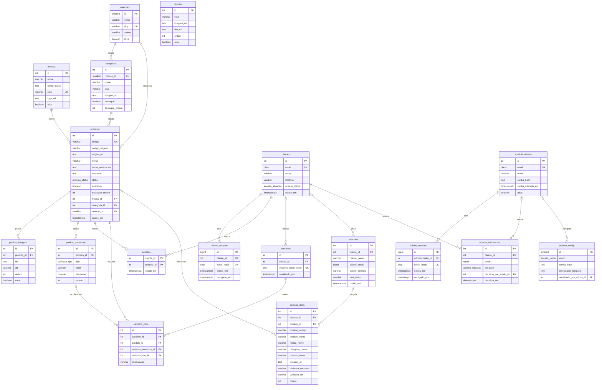

# Modelagem do banco — Loja virtual VIP Imports

**Tarefa 1 da Fatia 0** — desenho das tabelas, revisado na tarefa 2 depois de doze decisões fecharem contra o contrato de API v1.0 (seção 8). É a base direta das migrações Alembic escritas na tarefa 2 — não existe mais pergunta em aberto que mude o esquema.

**Stack alvo:** PostgreSQL 16, SQLAlchemy 2.0, Alembic, FastAPI.
**Fonte da verdade:** contrato de API v1.0. Toda coluna aqui existe porque algum endpoint do contrato precisa dela.

> **Aviso de vocabulário.** Este documento vai ser lido por gente que não trabalha com banco todo dia. Sempre que um termo técnico aparece pela primeira vez, ele vem explicado ali mesmo. Se algum trecho continuar obscuro, isso é bug do documento — avise.

---

## 1. Visão geral

O banco tem **cinco grupos de tabelas**, cada um existindo por um motivo diferente. O **catálogo** (`colecoes`, `marcas`, `categorias`, `produtos`, `produto_imagens`, `produto_variacoes`, `banners`) guarda o que o visitante vê: é o grupo com volume real, ~11.569 produtos, e é onde os índices decidem se o site é rápido ou não. A **identidade do cliente** (`clientes`, `cliente_sessoes`) resolve a área do cliente sem senha — o e-mail identifica, a sessão é um token opaco guardado como hash. A **seleção em andamento** (`favoritos`, `carrinhos`, `carrinho_itens`) é o rascunho do visitante: dado vivo, que aponta para o produto atual e desaparece junto com ele. A **seleção enviada** (`selecoes`, `selecao_itens`) é o oposto exato: dado congelado, cópia em texto do que o cliente viu no instante em que apertou enviar, que precisa sobreviver a renomeação e exclusão de produto. E o **acesso administrativo e o controle de entrada** (`administradores`, `admin_sessoes`, `acesso_config`, `acesso_solicitacoes`) formam um sistema separado do cliente: senha argon2, sessão própria, nenhuma chave cruzando — mais a estrutura da seção 05 do contrato já modelada, ainda que sem rota. **Não existe coluna de preço, valor, frete ou estoque em lugar nenhum deste desenho**: a loja é catálogo, o preço é confirmado no atendimento.

São **18 tabelas**, **4 tipos enumerados** e **58 índices** (contando os que vêm de chave primária e restrição de unicidade) — a tarefa 2 revisou os 69 originais da tarefa 1 e cortou onze sem endpoint real que os justificasse (seção 5.3).

---

## 2. Diagrama ER

> **Como ler.** `||--o{` é "um para muitos": um registro da esquerda se liga a zero ou mais da direita. `|o--o{` marca que o lado esquerdo é opcional (a referência pode ser nula). `PK` = chave primária, o identificador único da linha. `FK` = chave estrangeira, que aponta para a chave primária de outra tabela. `UK` = chave única, valor que não pode repetir.



---

## 3. Tipos enumerados

> **Enum** é um tipo de coluna que só aceita uma lista fechada de valores. O banco recusa qualquer coisa fora da lista, então é impossível gravar `"esgotado "` com espaço sobrando ou `"ESGOTADO"` por engano de digitação.

| Tipo | Valores | Onde é usado |
|---|---|---|
| `produto_status` | `normal`, `esgotado`, `oculto` | `produtos.status` |
| `acesso_modo` | `aberto`, `senha_compartilhada`, `aprovacao` | `acesso_config.modo` |
| `acesso_situacao` | `pendente`, `aprovado`, `recusado` | `clientes.acesso_status`, `acesso_solicitacoes.situacao` |
| `variacao_tipo` | `tamanho`, `cor` | `produto_variacoes.tipo` |

Semântica de `produto_status`, que é regra de negócio e não detalhe técnico:

- `normal` — aparece no site normalmente.
- `esgotado` — **continua aparecendo** no catálogo público, marcado visualmente. Não some, não é filtrado fora.
- `oculto` — **some do site**, mas o registro continua no banco. É o "excluir" seguro do painel: nenhum endpoint público devolve produto oculto, e o admin continua vendo e conseguindo reverter.

Acrescentar valor a um enum no PostgreSQL é `ALTER TYPE ... ADD VALUE`: barato, sem reescrever a tabela. Remover valor é que é caro. `variacao_tipo` ficou fechado em dois valores porque são os dois que o contrato documenta — numeração de calçado, cinto ou anel entra como **valor** de `tamanho` (ex.: `tipo = 'tamanho', valor = '42'`), não como um terceiro tipo. Se o catálogo real exigir um tipo genuinamente novo, `ALTER TYPE ADD VALUE` resolve sem remodelar nada.

---

## 4. Tabelas

Convenções que valem para todas, para não repetir a cada seção:

- **Nomes** em português, sem acento, `snake_case`. A conversão para `camelCase` do JSON acontece na camada de serviço (Pydantic), nunca no banco.
- **`id`** é `GENERATED BY DEFAULT AS IDENTITY` — a forma moderna do antigo `SERIAL`; o banco gera o número sozinho.
- **`criado_em` / `atualizado_em`** são `timestamptz`: data e hora **com fuso**, sempre gravadas em UTC. `timestamp` sem fuso mente no horário de verão e não deve aparecer em nenhuma tabela.
- **`ON DELETE`** define o que acontece com a linha filha quando a linha pai é apagada. `CASCADE` apaga junto, `RESTRICT` impede o apagamento do pai, `SET NULL` esvazia a referência e mantém a linha.

### 4.1 `colecoes`

Duas coleções fixas, Feminino e Masculino. É tabela e não enum porque `GET /colecoes` devolve objeto com `nome` e `slug`, e porque `categorias` precisa de chave estrangeira apontando para ela.

| Coluna | Tipo | Nulo | Padrão | Restrição | Observação |
|---|---|---|---|---|---|
| `id` | `smallint` | não | identity | PK | Duas linhas. `smallint` basta e deixa menor cada índice composto de `produtos` que carrega essa coluna. |
| `nome` | `varchar(40)` | não | — | — | O contrato mostra `"Feminina"` como nome e `"feminino"` como slug: são campos independentes, o nome não é derivado do slug. |
| `slug` | `varchar(40)` | não | — | UNIQUE | Usado em `GET /colecoes/:slug/categorias` e no filtro `?colecao=`. |
| `ordem` | `smallint` | não | `0` | — | Ordem de exibição explícita. |
| `ativa` | `boolean` | não | `true` | — | Desligar uma coleção sem apagar. |
| `criado_em` | `timestamptz` | não | `now()` | — | |
| `atualizado_em` | `timestamptz` | não | `now()` | — | |

As duas linhas entram por migração de dados (seed). O painel não expõe exclusão de coleção — o contrato não tem `DELETE /admin/colecoes`.

### 4.2 `marcas`

As ~18 grifes. Alimenta `GET /marcas`, o filtro `?marca=` e o bloco de marcas da home.

| Coluna | Tipo | Nulo | Padrão | Restrição | Observação |
|---|---|---|---|---|---|
| `id` | `integer` | não | identity | PK | |
| `nome` | `varchar(80)` | não | — | — | |
| `nome_busca` | `text` | não | — | — | Nome em minúsculas e sem acento, ex. `"chanel"`. **Preenchida pela aplicação** no `INSERT`/`UPDATE`, nunca por coluna gerada no banco. Ver a explicação em 5.1 — é decisão fechada, não detalhe de implementação. Serve à busca por marca ignorando acento e caixa (5.4). |
| `slug` | `varchar(80)` | não | — | UNIQUE | Marca é global, não pertence a coleção — Chanel aparece em Feminino e em Masculino. Aqui a unicidade **é** global, ao contrário de `categorias`. |
| `logo_url` | `text` | sim | — | — | Imagens entram por URL: o contrato não tem upload de arquivo em lugar nenhum. |
| `ordem` | `integer` | não | `0` | — | |
| `ativa` | `boolean` | não | `true` | — | Marca inativa some dos filtros públicos; os produtos dela continuam existindo. |
| `criado_em` | `timestamptz` | não | `now()` | — | |
| `atualizado_em` | `timestamptz` | não | `now()` | — | |

### 4.3 `categorias`

Categoria pertence a **uma** coleção. Bolsas de Feminino e Bolsas de Masculino são duas linhas diferentes com o mesmo slug.

| Coluna | Tipo | Nulo | Padrão | Restrição | Observação |
|---|---|---|---|---|---|
| `id` | `integer` | não | identity | PK | |
| `colecao_id` | `smallint` | não | — | FK → `colecoes.id`, `ON DELETE RESTRICT` | |
| `nome` | `varchar(80)` | não | — | — | |
| `slug` | `varchar(80)` | não | — | **UNIQUE (`colecao_id`, `slug`)** | Unicidade **composta**: o par é único, o slug sozinho não. Ver a nota logo abaixo. |
| `imagem_url` | `text` | sim | — | — | Usada no bloco de categorias em destaque da home. |
| `destaque` | `boolean` | não | `false` | — | Alimenta `PATCH /admin/destaques/categorias`. |
| `destaque_ordem` | `integer` | sim | — | CHECK: `destaque = false OR destaque_ordem IS NOT NULL` | Ordem numérica explícita, nunca ordem de inserção. Nulo quando não é destaque. |
| `ordem` | `integer` | não | `0` | — | Ordem dentro do menu da coleção. |
| `ativa` | `boolean` | não | `true` | — | |
| `criado_em` | `timestamptz` | não | `now()` | — | |
| `atualizado_em` | `timestamptz` | não | `now()` | — | |

```sql
UNIQUE (colecao_id, slug)   -- a regra de negócio
UNIQUE (id, colecao_id)     -- aparentemente redundante; a razão está em 4.4
```

#### Por que não existe `GET /categorias/:slug`

Porque `bolsas` não identifica nada sozinho. Existem duas categorias com esse slug — uma em Feminino, outra em Masculino — e elas têm listas de produtos diferentes. Uma rota `GET /categorias/bolsas` teria que escolher uma das duas arbitrariamente, devolver as duas misturadas, ou inventar um critério de desempate. As três saídas são bug esperando data.

A chave real da categoria é o **par** (coleção, slug). O contrato reflete isso literalmente: a rota é `GET /colecoes/:slug/categorias`, ou seja, você primeiro diz de qual coleção está falando e só então as categorias fazem sentido. O banco não está sendo restritivo por gosto — está descrevendo o mesmo fato que a URL já descreve. Se algum dia alguém quiser a rota solta, ela vai precisar de um parâmetro de coleção de qualquer forma, e aí é a rota atual com outra roupa.

O mesmo raciocínio atinge o filtro `?categoria=` de `GET /produtos`: ele só é determinístico acompanhado de `?colecao=`. **Decidido:** `?categoria=` sem `?colecao=` é erro de validação, não ambiguidade tolerada. A API devolve `400` com

```json
{ "erro": { "campos": { "colecao": "Obrigatório quando categoria é informada." } } }
```

antes mesmo de tocar o banco. Do lado do banco isso não muda nada: o serviço sempre resolve `categoria_id` pelo par (`colecao_id`, `slug`) via o índice `ux_categorias_colecao_slug` (seção 5.3), então a consulta em `produtos` nunca filtra por categoria sem já saber a coleção.

### 4.4 `produtos`

O centro do banco. ~11.569 linhas.

| Coluna | Tipo | Nulo | Padrão | Restrição | Observação |
|---|---|---|---|---|---|
| `id` | `integer` | não | identity | PK | O contrato expõe `id` numérico no JSON, além do `codigo`. |
| `codigo` | `varchar(32)` | não | — | UNIQUE | Chave de negócio, tipo `CHN-0042`. **Gerada pela No Fear** no padrão da tarefa 71 (prefixo de marca + sequência), não copiada da origem. Único por construção — o gerador não repete —, mas a restrição `UNIQUE` do banco fica como rede de segurança mesmo assim: construção correta é a primeira linha de defesa, não a única. |
| `codigo_origem` | `varchar(80)` | sim | — | sem restrição | Código do produto **na fonte de dados original** (planilha, dump, o que a tarefa 38 encontrar). Não é o `codigo` da loja. Nulável e sem `UNIQUE`: a origem pode ter duplicata, vir vazia ou nem existir para um produto cadastrado manualmente. Serve à rastreabilidade e à deduplicação da tarefa 72. |
| `origem_url` | `text` | sim | — | sem restrição | URL ou referência de onde o produto foi extraído, quando existir. Mesmo raciocínio de `codigo_origem`: dado de rastreabilidade, não de negócio, por isso nulável e sem unicidade. |
| `nome` | `varchar(180)` | não | — | — | |
| `nome_ordenacao` | `text` | não | — | — | Nome em minúsculas e sem acento. **Preenchida pela aplicação** no `INSERT`/`UPDATE`, nunca por coluna gerada no banco — ver 5.1 para o motivo, que é decisão fechada. Serve a dois propósitos com a mesma cópia de texto: ordenar `?ordem=nome` ignorando acento/caixa (5.2) e alimentar o índice de busca por trigrama (5.4). |
| `descricao` | `text` | sim | — | — | Só aparece em `GET /produtos/:codigo`, nunca na listagem. |
| `status` | `produto_status` | não | `'normal'` | — | Três valores, seção 3. |
| `destaque` | `boolean` | não | `false` | — | `PATCH /admin/destaques/produtos`. |
| `destaque_ordem` | `integer` | sim | — | CHECK: `destaque = false OR destaque_ordem IS NOT NULL` | Ordem numérica explícita na home. |
| `marca_id` | `integer` | não | — | FK → `marcas.id`, `ON DELETE RESTRICT` | `RESTRICT` porque apagar uma marca que tem produtos deve falhar e obrigar o admin a decidir o que fazer com eles. |
| `categoria_id` | `integer` | não | — | FK composta, abaixo | |
| `colecao_id` | `smallint` | não | — | FK composta, abaixo | Duplicado de propósito, com trava. Ver nota. |
| `criado_em` | `timestamptz` | não | `now()` | — | É o campo de ordenação de `?ordem=recentes`. |
| `atualizado_em` | `timestamptz` | não | `now()` | — | |

**Sobre `colecao_id` estar aqui.** A coleção do produto já é dedutível pela categoria (`produtos → categorias → colecoes`). Guardar de novo é duplicação, e duplicação sem trava vira inconsistência: um dia alguém move a categoria de coleção e metade dos produtos passa a apontar para a coleção errada. A trava é uma chave estrangeira composta:

```sql
-- em categorias:
UNIQUE (id, colecao_id)

-- em produtos:
FOREIGN KEY (categoria_id, colecao_id) REFERENCES categorias (id, colecao_id)
```

Com isso o banco **garante** que o `colecao_id` do produto é sempre o mesmo da sua categoria. Não dá para dessincronizar nem por bug de aplicação nem por `UPDATE` manual em produção. O ganho é que o filtro `?colecao=` e a paginação por cursor leem uma coluna da própria `produtos`, sem `JOIN`, e o índice composto de coleção existe de verdade (5.2). Sem essa coluna, filtrar por coleção obrigaria a juntar duas tabelas antes de conseguir aplicar o índice de ordenação — que é justamente o caso em que o planejador desiste do índice e varre a tabela inteira.

**Sobre a capa.** Não existe `capa_imagem_id` em `produtos`. Se existisse, `produtos` apontaria para `produto_imagens` e `produto_imagens` apontaria de volta para `produtos`: referência circular, que complica inserção, exclusão e ordem de migração. A capa mora em `produto_imagens.capa`, com índice único parcial garantindo no máximo uma por produto (4.5).

**Sobre `relacionados`.** `GET /produtos/:codigo/relacionados` não tem tabela. É consulta derivada — mesma categoria, preferindo a mesma marca, excluindo o próprio produto e os ocultos, com limite. Decisão em 6.7.

**Sobre preço.** Não existe. Nenhuma coluna de valor, custo, moeda, desconto, faixa ou "a partir de". Se numa revisão futura aparecer uma, o desenho está errado.

**Sobre `GET /admin/produtos`.** Decidido: inclui produtos `oculto` por padrão (é o que a seção 4.2 do contrato descreve), com filtro de `status` opcional para quem quiser restringir. A alteração em lote (`POST /admin/produtos/lote`) aceita exatamente quatro campos — `status`, `destaque`, `marca_id`, `categoria_id` — e nenhum outro. Nenhuma coluna nova decorre disso: os quatro já existem e já são a coluna mais à esquerda de algum índice (5.3).

### 4.5 `produto_imagens`

As fotos, em ordem explícita. Entram por URL — o contrato fala em "imagens por URL", não em upload.

| Coluna | Tipo | Nulo | Padrão | Restrição | Observação |
|---|---|---|---|---|---|
| `id` | `integer` | não | identity | PK | O contrato expõe `imagens[].id`. |
| `produto_id` | `integer` | não | — | FK → `produtos.id`, `ON DELETE CASCADE` | Apagou o produto, apagou as fotos. Foto não tem vida própria. |
| `url` | `text` | não | — | — | `text` e não `varchar(n)`: URL de CDN com parâmetros passa fácil de 255 caracteres e, no PostgreSQL, `text` e `varchar` têm exatamente o mesmo desempenho e armazenamento. |
| `alt` | `varchar(200)` | sim | — | — | Texto alternativo, acessibilidade. O contrato devolve `alt` na capa e em cada imagem. |
| `ordem` | `integer` | não | `1` | UNIQUE (`produto_id`, `ordem`) DEFERRABLE | Numérica e explícita. Ver nota sobre `DEFERRABLE`. |
| `capa` | `boolean` | não | `false` | índice único parcial | No máximo uma capa por produto. |
| `criado_em` | `timestamptz` | não | `now()` | — | |

```sql
UNIQUE (produto_id, ordem) DEFERRABLE INITIALLY DEFERRED
CREATE UNIQUE INDEX ux_produto_imagens_capa ON produto_imagens (produto_id) WHERE capa;
```

**Por que `DEFERRABLE`.** O endpoint de reordenar imagens manda a lista nova inteira. Trocar a imagem 1 com a 2 dentro de uma transação passa por um instante em que duas linhas têm `ordem = 1`. Com restrição comum, o banco recusa no meio do caminho e o serviço precisaria de gambiarra — gravar ordens negativas temporárias, por exemplo. `DEFERRABLE INITIALLY DEFERRED` faz o banco conferir só quando a transação vai fechar: o estado intermediário é permitido, o estado final não pode ter duplicata.

**Índice único parcial** é um índice que só inclui as linhas que satisfazem uma condição (`WHERE capa`). Como só as capas entram nele, ele fica minúsculo e garante "uma capa por produto" sem impedir que existam várias imagens com `capa = false`.

Produto sem imagem nenhuma é possível no banco — o admin cadastra e anexa depois. **Decidido:** o serviço devolve `capa: null` nesse caso, sem placeholder — o contrato já tipa `capa` como campo opcional, e a tarefa 68 do plano precisa **contar** quantos produtos ficaram sem imagem, o que só é possível se a ausência for um `null` real e não uma URL genérica mascarando o problema. A contagem em si não precisa de índice novo: `produto_id` já é a coluna mais à esquerda do índice `ux_produto_imagens_ordem`, então "produtos sem nenhuma linha em `produto_imagens`" é uma verificação de existência barata sobre esse mesmo índice.

### 4.6 `produto_variacoes`

Tamanho, cor, numeração. Sem preço, sem estoque, sem SKU: só "existe / não existe".

| Coluna | Tipo | Nulo | Padrão | Restrição | Observação |
|---|---|---|---|---|---|
| `id` | `integer` | não | identity | PK | O contrato expõe `variacoes[].id`, e o carrinho referencia esse id. |
| `produto_id` | `integer` | não | — | FK → `produtos.id`, `ON DELETE CASCADE` | |
| `tipo` | `variacao_tipo` | não | — | UNIQUE (`produto_id`, `tipo`, `valor`) | Enum fechado em `tamanho` e `cor` (seção 3) — os dois que o contrato documenta. Numeração de calçado é `tipo = 'tamanho', valor = '42'`, não um terceiro tipo. |
| `valor` | `varchar(60)` | não | — | idem | `"M"`, `"Preto"`, `"42"`. Texto porque a grade varia de marca para marca. |
| `disponivel` | `boolean` | não | `true` | — | **Isto não é estoque.** É um sinalizador manual do admin: "esse tamanho eu não tenho". Não tem quantidade, não decrementa sozinho, ninguém reserva nada. |
| `ordem` | `integer` | não | `0` | — | P, M, G não ordena alfabeticamente. Por isso a ordem é numérica e manual. |
| `criado_em` | `timestamptz` | não | `now()` | — | |
| `atualizado_em` | `timestamptz` | não | `now()` | — | |

### 4.7 `banners`

Faixas da home. Alimenta `GET /home` e o CRUD `/admin/banners`. **Decidido:** sem agendamento — o escopo assinado (proposta comercial item 2) prevê "banner em carrossel com até 4 imagens administráveis", e o campo `ativo` já resolve "mostra ou não mostra". Colunas de `inicia_em`/`termina_em` foram removidas do desenho; não ficam "para o futuro" ocupando lugar numa tabela cujo volume de linhas é baixíssimo — se agendamento entrar no escopo um dia, é `ALTER TABLE ADD COLUMN` numa tabela de poucas dezenas de linhas, operação instantânea.

| Coluna | Tipo | Nulo | Padrão | Restrição | Observação |
|---|---|---|---|---|---|
| `id` | `integer` | não | identity | PK | |
| `titulo` | `varchar(120)` | sim | — | — | Banner pode ser só imagem. |
| `subtitulo` | `varchar(200)` | sim | — | — | |
| `imagem_url` | `text` | não | — | — | |
| `imagem_url_mobile` | `text` | sim | — | — | Nulo significa "usa a mesma imagem do desktop". |
| `alt` | `varchar(200)` | sim | — | — | |
| `link_url` | `text` | sim | — | — | Para onde o banner leva. Nulo = banner não clicável. |
| `ordem` | `integer` | não | `0` | — | Explícita. |
| `ativo` | `boolean` | não | `true` | — | |
| `criado_em` | `timestamptz` | não | `now()` | — | |
| `atualizado_em` | `timestamptz` | não | `now()` | — | |

### 4.8 `clientes`

Identidade sem senha. `POST /clientes/identificar` recebe o e-mail; se não existe, cria; se existe, reaproveita. **Não há coluna de senha aqui e não deve haver.**

| Coluna | Tipo | Nulo | Padrão | Restrição | Observação |
|---|---|---|---|---|---|
| `id` | `integer` | não | identity | PK | |
| `email` | `citext` | não | — | UNIQUE | `citext` é um tipo de texto que ignora maiúsculas na comparação: `Jose@X.com` e `jose@x.com` são a mesma linha. Sem ele, o mesmo cliente vira dois cadastros e perde os favoritos. Exige `CREATE EXTENSION citext`. |
| `nome` | `varchar(120)` | sim | — | — | Preenchido depois, via `PATCH /clientes/eu`. |
| `telefone` | `varchar(20)` | sim | — | — | Só dígitos, com DDI e DDD, normalizado no serviço. É por onde o atendimento responde. **Nenhuma rota pública devolve telefone completo** — só aparece em `GET /clientes/eu` (o próprio cliente autenticado) e nas rotas `/admin`. |
| `acesso_status` | `acesso_situacao` | não | `'aprovado'` | — | Só tem efeito quando `acesso_config.modo = 'aprovacao'`. Está duplicado aqui de propósito: a checagem roda em toda requisição autenticada e não pode custar um `JOIN` com a fila. Ver 4.18. |
| `ultimo_acesso_em` | `timestamptz` | sim | — | — | Alimenta `GET /admin/clientes`. |
| `criado_em` | `timestamptz` | não | `now()` | — | |
| `atualizado_em` | `timestamptz` | não | `now()` | — | |

**Limitação conhecida e aceita.** Identificação só por e-mail, sem verificação, significa que qualquer pessoa que digite o e-mail de outra entra na conta dela e vê favoritos, carrinho e seleções enviadas. Isso é decisão de produto assumida pelo cliente da No Fear, não descuido do desenho. A mitigação que o banco oferece é limitar o dano: nenhuma rota pública devolve telefone completo (acima), e não há dado de pagamento em lugar nenhum do sistema para vazar junto.

### 4.9 `cliente_sessoes`

Sessão do cliente. Sistema **completamente separado** de `admin_sessoes`: outra tabela, outro cookie, outro tempo de expiração, nenhuma chave cruzando.

| Coluna | Tipo | Nulo | Padrão | Restrição | Observação |
|---|---|---|---|---|---|
| `id` | `bigint` | não | identity | PK | `bigint` porque sessão é a tabela que mais cresce ao longo do tempo. |
| `cliente_id` | `integer` | não | — | FK → `clientes.id`, `ON DELETE CASCADE` | |
| `token_hash` | `char(64)` | não | — | UNIQUE | **SHA-256 em hexadecimal do token.** O token em si (32 bytes aleatórios) vai para o cookie e **nunca é gravado**. Se o banco vazar, ninguém consegue se passar por cliente nenhum. |
| `criado_em` | `timestamptz` | não | `now()` | — | |
| `expira_em` | `timestamptz` | não | `now() + 90 dias` | — | **90 dias, renovada a cada uso.** Toda requisição autenticada válida escreve `expira_em = now() + 90 dias` de novo — é a aplicação que faz isso a cada acesso, não o banco sozinho. Cliente ativo nunca é deslogado; cliente que some 90 dias precisa se identificar de novo. |
| `revogado_em` | `timestamptz` | sim | — | — | `POST /clientes/sair` preenche isto em vez de apagar a linha, o que preserva o rastro. |
| `ip` | `inet` | sim | — | — | `inet` é tipo nativo de endereço IP, valida o formato sozinho. |
| `user_agent` | `text` | sim | — | — | |

**Por que SHA-256 aqui e argon2 na senha do admin.** Argon2 é lento de propósito, para encarecer a força bruta contra senha humana — que é curta e adivinhável. Token de sessão é aleatório de 256 bits: força bruta é inviável por definição, e o hash é conferido a cada requisição. Nesse caso hash rápido é a escolha certa. Para senha de administrador é o contrário, e lá é argon2 mesmo (4.15).

### 4.10 `favoritos`

Tabela de ligação pura, sem `id` próprio.

| Coluna | Tipo | Nulo | Padrão | Restrição | Observação |
|---|---|---|---|---|---|
| `cliente_id` | `integer` | não | — | PK composta, FK → `clientes.id` `ON DELETE CASCADE` | |
| `produto_id` | `integer` | não | — | PK composta, FK → `produtos.id` `ON DELETE CASCADE` | Favorito é dado vivo, não histórico: produto apagado sai dos favoritos e ninguém sente falta. |
| `criado_em` | `timestamptz` | não | `now()` | — | |

A chave primária é o par (`cliente_id`, `produto_id`). Isso torna `DELETE /favoritos/:produtoId` direto e impede favoritar duas vezes sem nenhuma checagem na aplicação: o banco recusa antes.

### 4.11 `carrinhos`

O rascunho. Existe tanto para visitante não identificado quanto para cliente, e é isso que torna `POST /carrinho/migrar` possível.

| Coluna | Tipo | Nulo | Padrão | Restrição | Observação |
|---|---|---|---|---|---|
| `id` | `integer` | não | identity | PK | |
| `cliente_id` | `integer` | sim | — | FK → `clientes.id` `ON DELETE CASCADE`, único parcial | Nulo enquanto o visitante não se identificou. |
| `visitante_token_hash` | `char(64)` | sim | — | UNIQUE | Mesmo esquema de hash da sessão. Identifica o carrinho anônimo. |
| `criado_em` | `timestamptz` | não | `now()` | — | |
| `atualizado_em` | `timestamptz` | não | `now()` | — | Base para a limpeza de carrinho abandonado. |

```sql
CHECK (cliente_id IS NOT NULL OR visitante_token_hash IS NOT NULL)
CREATE UNIQUE INDEX ux_carrinhos_cliente ON carrinhos (cliente_id) WHERE cliente_id IS NOT NULL;
```

**Como `POST /carrinho/migrar` funciona neste desenho.** O visitante monta o carrinho anônimo. Ao se identificar, o serviço tem os dois carrinhos em mãos: move os itens do anônimo para o do cliente — ignorando o que já existe lá, porque o conjunto (produto, tamanho, cor) é a identidade do item e não há quantidade para somar — e apaga o carrinho anônimo. Tudo numa transação só. O índice único parcial acima garante um carrinho por cliente, então nunca existe o caso de "o cliente tem dois carrinhos e não sei qual é o bom".

### 4.12 `carrinho_itens`

| Coluna | Tipo | Nulo | Padrão | Restrição | Observação |
|---|---|---|---|---|---|
| `id` | `integer` | não | identity | PK | É o `:itemId` de `PATCH` e `DELETE /carrinho/:itemId`. |
| `carrinho_id` | `integer` | não | — | FK → `carrinhos.id` `ON DELETE CASCADE` | |
| `produto_id` | `integer` | não | — | FK → `produtos.id` `ON DELETE CASCADE` | Dado **vivo**: nome e foto vêm do produto atual, em tempo real. É o contraste exato com `selecao_itens`. |
| `variacao_tamanho_id` | `integer` | sim | — | FK composta → `produto_variacoes (id, tipo)` `ON DELETE SET NULL (variacao_tamanho_id)` | Nulo quando o produto não tem tamanho ou o cliente não escolheu. Se a variação for apagada, o item permanece e o serviço pede a escolha de novo. |
| `variacao_cor_id` | `integer` | sim | — | FK composta → `produto_variacoes (id, tipo)` `ON DELETE SET NULL (variacao_cor_id)` | Idem, para cor. |
| `variacao_tamanho_tipo` | `variacao_tipo` | não | `'tamanho'` | CHECK `= 'tamanho'` | Valor constante. Existe só para a FK composta ter o tipo do lado de cá — ver abaixo. Nenhuma rota escreve nela. |
| `variacao_cor_tipo` | `variacao_tipo` | não | `'cor'` | CHECK `= 'cor'` | Idem. |
| `observacao` | `varchar(280)` | sim | — | — | "quero na cor bege". Vira texto na mensagem de WhatsApp. |
| `criado_em` | `timestamptz` | não | `now()` | — | |
| `atualizado_em` | `timestamptz` | não | `now()` | — | |

```sql
UNIQUE NULLS NOT DISTINCT (carrinho_id, produto_id, variacao_tamanho_id, variacao_cor_id)
```

`NULLS NOT DISTINCT` é recurso do PostgreSQL 15+ e resolve um detalhe chato: por padrão o banco trata dois `NULL` como valores diferentes, então "produto 812 sem variação" poderia ser adicionado dez vezes sem violar nada. Com essa cláusula, o `NULL` conta como valor igual e a duplicata é barrada. Como o alvo é PostgreSQL 16, dá para usar direto.

**Uma variação de cada tipo, não uma variação só (revisão 0005).** O contrato mostra a seleção como "(Chanel, M / Preto)" e a página do produto tem os dois seletores — com uma coluna `variacao_id` só, o cliente escolhia um ou outro. Como `variacao_tipo` é enum fechado em dois valores, uma coluna nulável por tipo dá "no máximo um de cada" sem tabela de ligação e sem regra em código contando variações.

O que impede uma cor de ser gravada na coluna de tamanho é a **FK composta**, não a CHECK: `CHECK` não aceita subconsulta e por isso não enxerga `produto_variacoes`. Então o tipo viaja junto na linha, em colunas de valor constante preenchidas pelo `DEFAULT`, e o par vai inteiro na referência:

```sql
FOREIGN KEY (variacao_tamanho_id, variacao_tamanho_tipo)
    REFERENCES produto_variacoes (id, tipo)
    ON DELETE SET NULL (variacao_tamanho_id)
```

A CHECK prende cada coluna de tipo ao seu valor; a FK prova que o tipo declarado é o tipo real da variação apontada. Gravar o id de uma cor em `variacao_tamanho_id` estoura a FK; gravar `'cor'` na coluna de tipo estoura a CHECK. É o mesmo padrão de `produtos (categoria_id, colecao_id)` da seção 4.4, e exige `UNIQUE (id, tipo)` em `produto_variacoes` — `id` já é PK, mas o PostgreSQL cobra unicidade declarada no par exato. A lista de colunas em `ON DELETE SET NULL` é sintaxe do PostgreSQL 15: sem ela o banco tentaria zerar também a coluna de tipo, que é `NOT NULL`.

**Não há coluna de quantidade** (saiu na revisão 0005, sem nunca ter sido lida ou escrita por rota nenhuma): isto é catálogo de seleção, não loja com estoque. O mesmo produto com pares diferentes são itens diferentes; com o mesmo par, é um item só.

### 4.13 `selecoes`

A seleção **enviada**. Daqui em diante é histórico, não rascunho.

**Decidido:** sem coluna de código e sem status de atendimento. A resposta de `POST /selecoes` no contrato tem exatamente `id`, `criadoEm`, `itens`, `mensagemWhatsapp` e `linkWhatsapp` — fluxo de atendimento (fila, "visualizado", código para o cliente citar) não está contratado. `mensagemWhatsapp` e `linkWhatsapp` **não são colunas**: são montados pelo serviço a partir das linhas de `selecao_itens` no momento da resposta, e não precisam ser guardados — é texto derivado, reconstruível a qualquer momento a partir do dado congelado.

| Coluna | Tipo | Nulo | Padrão | Restrição | Observação |
|---|---|---|---|---|---|
| `id` | `integer` | não | identity | PK | `GET /admin/selecoes/:id`; é o `id` que `POST /selecoes` devolve. |
| `cliente_id` | `integer` | sim | — | FK → `clientes.id` `ON DELETE SET NULL` | Nulável e sem cascata: cliente apagado não leva o histórico junto. |
| `cliente_nome` | `varchar(120)` | sim | — | — | **Congelado.** Cópia do nome no instante do envio. |
| `cliente_email` | `citext` | não | — | — | **Congelado.** É por aqui que o atendimento acha o cliente mesmo se o cadastro sumir. |
| `cliente_telefone` | `varchar(20)` | sim | — | — | **Congelado.** |
| `observacao` | `text` | sim | — | — | Recado geral do cliente sobre a seleção inteira, quando o formulário de envio aceitar um. Entra na `mensagemWhatsapp` montada pelo serviço. |
| `total_itens` | `smallint` | não | — | CHECK `>= 0` | Contagem gravada no envio. Evita um `COUNT` por linha na listagem de `GET /admin/selecoes`. |
| `criado_em` | `timestamptz` | não | `now()` | — | Momento do envio. É o `criadoEm` da resposta e o que ordena a listagem do painel. |

### 4.14 `selecao_itens`

**A tabela mais importante do desenho do ponto de vista de negócio.** Aqui nada é vivo: tudo é cópia em texto do que o cliente viu na tela.

| Coluna | Tipo | Nulo | Padrão | Restrição | Observação |
|---|---|---|---|---|---|
| `id` | `integer` | não | identity | PK | |
| `selecao_id` | `integer` | não | — | FK → `selecoes.id` `ON DELETE CASCADE` | |
| `produto_id` | `integer` | sim | — | FK → `produtos.id` **`ON DELETE SET NULL`** | Referência mantida, **nulável e sem cascata**: produto apagado deixa a linha do item intacta com todos os dados congelados, perdendo só o link. É exatamente a regra 4. |
| `produto_codigo` | `varchar(32)` | não | — | — | **Congelado.** |
| `produto_nome` | `varchar(180)` | não | — | — | **Congelado.** |
| `marca_nome` | `varchar(80)` | não | — | — | **Congelado.** |
| `categoria_nome` | `varchar(80)` | não | — | — | **Congelado.** |
| `colecao_nome` | `varchar(40)` | não | — | — | **Congelado.** |
| `imagem_url` | `text` | sim | — | — | **Congelada** a URL da capa no momento do envio. Se o arquivo sair do CDN a imagem quebra, mas o registro continua correto. |
| `variacao_tamanho` | `varchar(60)` | sim | — | — | **Congelado como texto**, não como enum nem FK: se a variação for renomeada ou apagada, o histórico não muda junto. Uma coluna por tipo, espelhando o carrinho (revisão 0005) — com uma coluna só, o item enviado como "M / Preto" voltaria do histórico como "M". |
| `variacao_cor` | `varchar(60)` | sim | — | — | **Congelado.** |
| `observacao` | `varchar(280)` | sim | — | — | Copiada do item do carrinho. |
| `ordem` | `integer` | não | `0` | — | Ordem em que o cliente montou. Explícita. |
| `criado_em` | `timestamptz` | não | `now()` | — | |

**Por que congelar.** O painel de atendimento precisa mostrar *o que o cliente viu*, não *o que o produto é hoje*. Se a atendente abre uma seleção de três semanas atrás e o produto foi renomeado nesse meio-tempo, ela cita um nome que o cliente nunca viu e a conversa descarrila. Se o produto foi excluído, a linha inteira sumiria — e o cliente estaria falando de um item que o painel jura que nunca existiu. Congelar custa algumas centenas de bytes por item e resolve os dois casos de uma vez.

Repare que **não há preço congelado**, porque não há preço em lugar nenhum. O que se congela é identidade e descrição, não valor.

### 4.15 `administradores`

| Coluna | Tipo | Nulo | Padrão | Restrição | Observação |
|---|---|---|---|---|---|
| `id` | `integer` | não | identity | PK | |
| `nome` | `varchar(120)` | não | — | — | |
| `email` | `citext` | não | — | UNIQUE + CHECK `email = lower(email)` | Login. Totalmente independente de `clientes.email` — o mesmo endereço pode existir nas duas tabelas sem nenhuma relação entre elas. O `citext` resolve a comparação; a CHECK (revisão 0006) resolve a forma gravada, para o painel e o log não mostrarem "Jose@X.com". Não é tautologia: `lower()` devolve `text`, e citext comparado com text usa o operador de text, que diferencia caixa. |
| `senha_hash` | `text` | não | — | — | **argon2id.** Algoritmo lento e com uso alto de memória, desenhado para tornar caro o ataque de força bruta contra senha humana. O hash já carrega sal e parâmetros dentro da própria string, então não existe coluna de sal separada. |
| `senha_alterada_em` | `timestamptz` | não | `now()` | — | Atualizada toda vez que a senha muda. É o que permite invalidar sessões abertas sem apagar linha por linha de `admin_sessoes`: a checagem de sessão compara `admin_sessoes.criado_em` com `administradores.senha_alterada_em` — sessão criada antes da última troca de senha é tratada como inválida. |
| `ativo` | `boolean` | não | `true` | — | Desligar admin sem apagar e perder o rastro de quem decidiu o quê. |
| `ultimo_login_em` | `timestamptz` | sim | — | — | |
| `criado_em` | `timestamptz` | não | `now()` | — | |
| `atualizado_em` | `timestamptz` | não | `now()` | — | |

**Decidido:** não há rota de cadastro nem de troca de senha pela API — a proposta comercial (item 2.4) não contratou isso, e o contrato só tem `POST`/`DELETE /admin/sessao`. Duas contas no lançamento (cliente No Fear e suporte No Fear), criadas e com senha trocada por **comando de linha** — `scripts/criar_admin.py` e `scripts/trocar_senha_admin.py`, escritos na fatia 4. Por isso a migração de dados de referência (tarefa 2, revisão 0002) não semeia nenhum administrador — contas de admin não são dado de referência do esquema, são operação manual de quem sobe o ambiente.

### 4.16 `admin_sessoes`

Estrutura igual à de `cliente_sessoes`, em tabela separada de propósito.

| Coluna | Tipo | Nulo | Padrão | Restrição | Observação |
|---|---|---|---|---|---|
| `id` | `bigint` | não | identity | PK | |
| `administrador_id` | `integer` | não | — | FK → `administradores.id` `ON DELETE CASCADE` | |
| `token_hash` | `char(64)` | não | — | UNIQUE | SHA-256, mesmo esquema de 4.9. |
| `criado_em` | `timestamptz` | não | `now()` | — | |
| `expira_em` | `timestamptz` | não | `now() + 12 horas` | — | **12 horas, sem renovação automática.** Ao contrário da sessão de cliente, uso não estende o prazo — passadas 12 horas da abertura, o admin faz login de novo mesmo estando ativo. Prazo curto de propósito: é a área que expõe o CRUD inteiro do catálogo. |
| `revogado_em` | `timestamptz` | sim | — | — | `DELETE /admin/sessao`. |
| `ip` | `inet` | sim | — | — | |
| `user_agent` | `text` | sim | — | — | |

**Por que duas tabelas e não uma com coluna `tipo`.** Uma tabela única com `tipo = 'cliente' | 'admin'` transforma qualquer bug de filtro em escalada de privilégio: basta esquecer o `WHERE tipo = 'admin'` numa consulta para um token de cliente virar token de admin. Com tabelas separadas, o token de cliente simplesmente não existe na tabela que o painel consulta. O erro deixa de ser possível, em vez de depender de disciplina para ser evitado.

### 4.17 `acesso_config`

> **Atualização de 28/09/2026:** o cliente ligou o modo 3 (aprovação). As rotas saíram do congelamento, exceto `POST /acesso/senha` (modo 2). O desenho das tabelas não mudou. A revisão 0013 semeia a linha única em `'aberto'` (nenhuma migração anterior inseria a linha). Um cliente criado por `POST /clientes/identificar` com o modo em `'aprovacao'` nasce `acesso_status = 'pendente'`, e quem já existia continua `'aprovado'`. Revogar o acesso de alguém sem pedido pendente grava uma linha já decidida em `acesso_solicitacoes`, dentro do mesmo `CHECK`. Contrato para o frontend em `para-o-frontend.md`.

> **Atualização de 29/09/2026:** o cliente decidiu que a loja fica FECHADA o tempo todo, o que inverte a premissa da 0013 ("o site nunca sobe bloqueado"). A revisão 0014 grava `modo = 'aprovacao'` na linha única e muda o `DEFAULT` da coluna para `'aprovacao'`; linha ausente também conta como fechado. O valor `aberto` continua no enum `acesso_modo`, mas nenhuma rota o grava: `PATCH /admin/configuracao/acesso` só grava `mensagem_bloqueio`, e `{"modo": "aberto"}` dá 400. Quem já existia continua `'aprovado'`, então ninguém é trancado para fora. O `/admin/*` segue fora do portão.

Seção 05 do contrato: modo de acesso configurável. **Modelado agora, não implementado agora — reafirmado na revisão da tarefa 2.** As rotas continuam congeladas até decisão do cliente da No Fear, e a tabela continua existindo mesmo assim: é decisão deliberada, não escopo vazando. Remodelar isto depois de 11 mil produtos e uma base de clientes real cadastrados é exatamente o cenário que este desenho evita. Linha única.

| Coluna | Tipo | Nulo | Padrão | Restrição | Observação |
|---|---|---|---|---|---|
| `id` | `smallint` | não | `1` | PK, CHECK `id = 1` | Truque padrão de tabela de linha única: o `CHECK` torna fisicamente impossível existir uma segunda configuração. |
| `modo` | `acesso_modo` | não | `'aprovacao'` | — | Desde a 0014 a loja é sempre `aprovacao`. `aberto` = site público (não é mais gravado por rota nenhuma); `senha_compartilhada` = uma senha única para todo mundo entrar; `aprovacao` = o cliente se identifica e espera liberação. |
| `senha_hash` | `text` | sim | — | CHECK abaixo | argon2id da senha compartilhada. Mesmo sendo uma senha só, nunca em texto puro. |
| `mensagem_bloqueio` | `text` | sim | — | — | O que o visitante barrado lê na tela. |
| `atualizado_por_admin_id` | `integer` | sim | — | FK → `administradores.id` `ON DELETE SET NULL` | Quem mexeu por último. |
| `atualizado_em` | `timestamptz` | não | `now()` | — | |

```sql
CHECK (modo <> 'senha_compartilhada' OR senha_hash IS NOT NULL)
```

**Por que criar isso agora se as rotas estão congeladas.** Porque a tabela nasce com custo zero — uma linha, `modo = 'aberto'`, e absolutamente nada muda no comportamento do site. E porque a alternativa é acrescentar controle de acesso depois, com 11.569 produtos e clientes reais no banco, mexendo em `clientes` em produção. A regra 7 existe exatamente para evitar esse cenário: criar agora custa três tabelas dormentes, criar depois custa janela de manutenção.

### 4.18 `acesso_solicitacoes`

A fila de aprovação. Só é alimentada quando `acesso_config.modo = 'aprovacao'`.

| Coluna | Tipo | Nulo | Padrão | Restrição | Observação |
|---|---|---|---|---|---|
| `id` | `integer` | não | identity | PK | |
| `cliente_id` | `integer` | não | — | FK → `clientes.id` `ON DELETE CASCADE` | O cliente já foi criado por `POST /clientes/identificar`; a solicitação é sobre liberar o acesso dele. |
| `email` | `citext` | não | — | — | **Congelado**, pelo mesmo motivo da seleção: a fila precisa fazer sentido depois. |
| `nome` | `varchar(120)` | sim | — | — | Congelado. |
| `telefone` | `varchar(20)` | sim | — | — | Congelado. |
| `situacao` | `acesso_situacao` | não | `'pendente'` | índice único parcial | |
| `motivo` | `text` | sim | — | — | Justificativa da recusa, uso interno. |
| `decidido_por_admin_id` | `integer` | sim | — | FK → `administradores.id` `ON DELETE SET NULL` | |
| `decidido_em` | `timestamptz` | sim | — | CHECK abaixo | |
| `criado_em` | `timestamptz` | não | `now()` | — | |

```sql
CHECK ((situacao = 'pendente') = (decidido_em IS NULL))
CREATE UNIQUE INDEX ux_acesso_solicitacoes_pendente
  ON acesso_solicitacoes (cliente_id) WHERE situacao = 'pendente';
```

O `CHECK` amarra os dois campos: ou está pendente e sem data de decisão, ou está decidida e com data. Não existe estado meio-termo. O índice parcial garante uma solicitação pendente por cliente, mas permite histórico de várias recusadas.

Aprovar uma solicitação também grava `clientes.acesso_status = 'aprovado'`, na mesma transação. A tabela é o histórico auditável; a coluna em `clientes` é o que a autenticação lê a cada requisição.

---

## 5. Índices

> **Índice** é uma estrutura auxiliar que o banco mantém para achar linhas sem varrer a tabela toda. Ele acelera leitura e **encarece escrita**, porque cada `INSERT` e cada `UPDATE` da coluna indexada precisa atualizá-lo também. Com 11.569 produtos que quase nunca mudam e milhares de leituras por dia, a conta pende inteira para o lado da leitura.
>
> **Índice composto** é um índice sobre várias colunas em ordem. Ele só serve consultas que usam as colunas da **esquerda para a direita**: um índice em `(marca_id, criado_em, id)` serve uma busca por marca, e por marca + data, mas não serve uma busca só por data.
>
> **Índice parcial** é um índice com `WHERE`: só entram nele as linhas que satisfazem a condição. Fica menor, cabe em memória mais fácil e é atualizado com menos frequência.

### 5.1 Extensões e normalização de texto

```sql
CREATE EXTENSION IF NOT EXISTS citext;     -- e-mail que ignora maiúsculas
CREATE EXTENSION IF NOT EXISTS pg_trgm;    -- busca por trecho e por semelhança
```

Só duas extensões. `unaccent` **não entra no banco**, e essa ausência é decisão explícita, não descuido — é o tipo de coisa que alguém tenta "consertar" seis meses depois achando que esqueceram algo, por isso fica registrado aqui com o motivo inteiro.

**Por que `nome_ordenacao` (produtos) e `nome_busca` (marcas) não são colunas geradas.** A tentativa óbvia seria `GENERATED ALWAYS AS (unaccent(lower(nome))) STORED`. O PostgreSQL recusa: `unaccent()` é declarada `STABLE`, não `IMMUTABLE`, e coluna gerada exige `IMMUTABLE` — a garantia de que a função sempre devolve o mesmo resultado para a mesma entrada, em qualquer sessão, para sempre. Existe um contorno conhecido, que é embrulhar `unaccent()` numa função SQL declarada `IMMUTABLE` na marra, mentindo para o banco sobre uma garantia que `unaccent()` não dá de verdade — ela depende de um dicionário que pode mudar de versão do PostgreSQL para outra. Se isso acontecer, os índices que dependem da coluna ficam **silenciosamente** errados: nenhum erro aparece, a ordenação e a busca só começam a devolver resultado sutilmente furado, e o conserto é um `REINDEX` que ninguém sabe que precisa rodar.

**Decidido:** `nome_ordenacao` e `nome_busca` são colunas de texto comuns, sem geração automática nenhuma, **preenchidas pela aplicação** (camada de serviço, em Python) no `INSERT` e no `UPDATE`, antes de a linha chegar ao banco. O banco não promete imutabilidade nenhuma porque não calcula nada — só guarda o texto que a aplicação mandou. Isso desloca o problema de "índice pode corromper silenciosamente" para "a aplicação esqueceu de preencher a coluna num caminho de escrita", que é um bug visível na hora (a coluna é `NOT NULL` sem `DEFAULT`, então a gravação falha) em vez de um bug invisível que corrompe busca e ordenação sem avisar. Ver a decisão 6.13 para o comparativo completo.

As colunas ficam assim, sem `GENERATED`:

```sql
nome_ordenacao text NOT NULL   -- produtos; preenchida pela aplicação
nome_busca     text NOT NULL   -- marcas; preenchida pela aplicação
```

Isso também significa que, se algum dia alguém tentar "melhorar" isto trocando por coluna gerada com `unaccent()`, a resposta já está escrita aqui: não, porque `unaccent()` não é `IMMUTABLE` de verdade, e a alternativa de mentir sobre isso para o banco é o tipo de gambiarra que só quebra quando ninguém está olhando.

### 5.2 Catálogo público: filtros e paginação por cursor

#### O problema do OFFSET

A forma ingênua de paginar é `LIMIT 24 OFFSET 4800`. O banco não tem como pular direto para a linha 4801: ele lê e descarta as 4800 anteriores. Na página 200, a consulta lê 4824 linhas para devolver 24, e o planejador acaba concluindo que varrer a tabela sai mais barato que usar o índice — exatamente o oposto do que se queria. Além disso, se um produto novo entrar enquanto o visitante navega, tudo desloca uma posição e ele vê o mesmo item duas vezes, ou nunca vê um.

#### A solução: cursor (keyset)

Em vez de dizer "pule 4800", o cursor diz "continue **depois deste item**". A consulta vira uma comparação que o índice resolve com um único salto, e o custo da página 200 é igual ao da página 1.

O detalhe que faz isso funcionar é que a comparação precisa ser sobre um **par único**: o campo ordenado mais o `id`. Ordenar só por `criado_em` não basta, e aqui isso não é teoria: os 11.569 produtos vão entrar por importação em lote, e centenas deles vão ter `criado_em` idêntico até o microssegundo. Sem o `id` como desempate, a fronteira entre duas páginas cai no meio de um bloco de empates e o visitante pula ou repete itens de forma imprevisível.

**Ordenação `recentes`** (padrão do catálogo):

```sql
SELECT ...
FROM produtos p
WHERE p.status <> 'oculto'
  AND (p.criado_em, p.id) < (:cursor_criado_em, :cursor_id)   -- ausente na 1a página
ORDER BY p.criado_em DESC, p.id DESC
LIMIT :por_pagina;
```

`(a, b) < (x, y)` é comparação de linha, sintaxe nativa do PostgreSQL: compara `a` com `x` e, no empate, `b` com `y`. O planejador transforma isso num salto direto dentro do índice.

Índice que sustenta:

```sql
CREATE INDEX ix_produtos_pub_recentes ON produtos (criado_em DESC, id DESC)
  WHERE status <> 'oculto';
```

**Ordenação `nome`:**

```sql
SELECT ...
FROM produtos p
WHERE p.status <> 'oculto'
  AND (p.nome_ordenacao, p.id) > (:cursor_nome, :cursor_id)
ORDER BY p.nome_ordenacao ASC, p.id ASC
LIMIT :por_pagina;
```

```sql
CREATE INDEX ix_produtos_pub_nome ON produtos (nome_ordenacao COLLATE "C", id)
  WHERE status <> 'oculto';
```

`COLLATE "C"` ordena por byte, não pelas regras do idioma. Como `nome_ordenacao` já está minúsculo e sem acento (preenchido pela aplicação — 5.1), a ordem por byte é a ordem alfabética esperada — e é estável, rápida e imune a mudança de versão do ICU/glibc, que é uma causa clássica de índice corrompido em atualização de sistema operacional. A consulta precisa usar a **mesma** collation, senão o índice é ignorado.

#### Como o cursor é codificado

O cursor é opaco para o frontend: uma string que ele recebe e devolve sem interpretar. Por dentro, é base64url de um JSON pequeno:

```json
{ "o": "recentes", "v": "2026-09-10T14:03:21.481Z", "id": 812 }
```

- `o` — a ordenação em que o cursor foi emitido.
- `v` — o valor do campo ordenado da **última linha da página entregue** (`criado_em` ou `nome_ordenacao`).
- `id` — o `id` dessa mesma linha, o desempate.

Regras de uso que a tarefa 2 precisa respeitar:

1. Se o `o` do cursor não bate com o `?ordem=` da requisição, o cursor é inválido: erro 400, não "tenta adivinhar". Um cursor de `recentes` aplicado a `nome` produziria uma lista sem sentido.
2. Os filtros (`colecao`, `categoria`, `marca`, `busca`) precisam ser idênticos aos da página anterior. O serviço pode incluir um resumo (hash) dos filtros dentro do cursor e recusar se mudou.
3. O cursor **não** carrega deslocamento nem número de página — não existe "ir para a página 47" neste desenho, e isso é aceitável num catálogo com rolagem infinita.
4. `porPagina` deve ter teto no servidor (algo como 60). Sem teto, `?porPagina=100000` vira ataque de negação de serviço de graça.

#### Filtros combinados com ordenação

Cada filtro precisa do **seu próprio** índice composto, com a coluna do filtro à esquerda e o par de ordenação à direita. Sem isso, o banco filtra por marca usando um índice e depois ordena 800 linhas em memória — funciona, mas custa muito mais e piora conforme o catálogo cresce.

| Filtro | `?ordem=recentes` | `?ordem=nome` |
|---|---|---|
| nenhum | `ix_produtos_pub_recentes` | `ix_produtos_pub_nome` |
| `?marca=` | `ix_produtos_marca_recentes` | `ix_produtos_marca_nome` |
| `?categoria=` | `ix_produtos_categoria_recentes` | `ix_produtos_categoria_nome` |
| `?colecao=` | `ix_produtos_colecao_recentes` | `ix_produtos_colecao_nome` |

Para **combinações** de dois filtros (coleção + marca, por exemplo) o banco usa o índice mais seletivo e filtra o resto na leitura da linha. Com 11.569 produtos e ~18 marcas, isso é rápido o bastante e não justifica criar a explosão combinatória de índices. Se a telemetria mostrar uma combinação dominante em produção, aí sim cria-se o índice específico dela.

### 5.3 Lista completa de índices

Revisão da tarefa 2: cada índice de desempenho abaixo cita o endpoint e o parâmetro do contrato que ele sustenta. Onde não dava para citar um endpoint real, o índice foi cortado — são 11.569 inserts na carga da Fatia 5, e cada índice é escrita a mais em cada um deles. `[PK]` marca os que vêm de chave primária, `[UK]` os que vêm de restrição de unicidade — eles existem automaticamente por regra de integridade, não por desempenho, e por isso não entram na poda.

Onze índices saíram da versão da tarefa 1: dez de desempenho sem endpoint que os justificasse hoje, e um de unicidade (`ux_selecoes_codigo`) porque a coluna que ele protegia deixou de existir. Nenhum deles é definitivo — se um endpoint real vier a precisar (uma fila de aprovação com rota, uma rotina de limpeza de sessão), o índice volta com `CREATE INDEX CONCURRENTLY`, operação que não trava a tabela e não é o tipo de remodelagem cara que a regra 7 da tarefa 1 quer evitar. Adicionar índice depois é barato; adicionar coluna depois é que é caro.

#### `produtos`

| # | Índice | Definição | Serve |
|---|---|---|---|
| 1 | `pk_produtos` `[PK]` | `(id)` | Toda busca por `id`; alvo das FKs de favoritos, carrinho e seleção. |
| 2 | `ux_produtos_codigo` `[UK]` | `(codigo)` | `GET /produtos/:codigo`, `GET /produtos/:codigo/relacionados`, o casamento exato de `?busca=` com um código (5.4), e `POST /admin/produtos/lote` conferindo duplicidade na geração de código. |
| 3 | `ix_produtos_pub_recentes` | `(criado_em DESC, id DESC) WHERE status <> 'oculto'` | `GET /produtos` sem `colecao`/`categoria`/`marca`, `?ordem=recentes` (padrão) + `?cursor=`. Também a vitrine de `GET /home`. |
| 4 | `ix_produtos_pub_nome` | `(nome_ordenacao COLLATE "C", id) WHERE status <> 'oculto'` | `GET /produtos` sem filtro de catálogo, `?ordem=nome` + `?cursor=`. |
| 5 | `ix_produtos_marca_recentes` | `(marca_id, criado_em DESC, id DESC) WHERE status <> 'oculto'` | `GET /produtos?marca=chanel&ordem=recentes`. |
| 6 | `ix_produtos_marca_nome` | `(marca_id, nome_ordenacao COLLATE "C", id) WHERE status <> 'oculto'` | `GET /produtos?marca=chanel&ordem=nome`. |
| 7 | `ix_produtos_categoria_recentes` | `(categoria_id, criado_em DESC, id DESC) WHERE status <> 'oculto'` | `GET /produtos?colecao=feminino&categoria=bolsas&ordem=recentes`. |
| 8 | `ix_produtos_categoria_nome` | `(categoria_id, nome_ordenacao COLLATE "C", id) WHERE status <> 'oculto'` | `GET /produtos?colecao=feminino&categoria=bolsas&ordem=nome`. |
| 9 | `ix_produtos_colecao_recentes` | `(colecao_id, criado_em DESC, id DESC) WHERE status <> 'oculto'` | `GET /produtos?colecao=feminino&ordem=recentes`. |
| 10 | `ix_produtos_colecao_nome` | `(colecao_id, nome_ordenacao COLLATE "C", id) WHERE status <> 'oculto'` | `GET /produtos?colecao=feminino&ordem=nome`. |
| 11 | `ix_produtos_destaque` | `(destaque_ordem, id) WHERE destaque AND status <> 'oculto'` | Vitrine de `GET /home`. Índice minúsculo, algumas dezenas de linhas. |
| 12 | `ix_produtos_admin` | `(status, criado_em DESC, id DESC)` | `GET /admin/produtos` — inclui `oculto` por padrão, por isso não tem `WHERE`; e o filtro de `status` opcional do mesmo endpoint. |
| 13 | `ix_produtos_relacionados` | `(categoria_id, marca_id, id) WHERE status <> 'oculto'` | `GET /produtos/:codigo/relacionados`: mesma categoria, priorizando a mesma marca. |
| 14 | `ix_produtos_nome_trgm` | GIN `(nome_ordenacao gin_trgm_ops)` | `GET /produtos?busca=` casando com o nome. Ver 5.4. |

Repare que `marca_id`, `categoria_id` e `colecao_id` **não** ganham índice simples: eles já são a coluna mais à esquerda dos compostos acima, o que serve tanto aos filtros quanto às verificações de chave estrangeira.

#### `marcas`, `colecoes`, `categorias`

| # | Índice | Definição | Serve |
|---|---|---|---|
| 15 | `pk_marcas` `[PK]` | `(id)` | |
| 16 | `ux_marcas_slug` `[UK]` | `(slug)` | Traduzir `GET /produtos?marca=chanel` em `marca_id` antes de aplicar o índice 5 ou 6; também `GET /marcas`. |
| 17 | `ix_marcas_nome_trgm` | GIN `(nome_busca gin_trgm_ops)` | `GET /produtos?busca=` casando com nome de marca. Ver 5.4. |
| 18 | `pk_colecoes` `[PK]` | `(id)` | |
| 19 | `ux_colecoes_slug` `[UK]` | `(slug)` | `GET /colecoes/:slug/categorias` e `GET /produtos?colecao=`. |
| 20 | `pk_categorias` `[PK]` | `(id)` | |
| 21 | `ux_categorias_colecao_slug` `[UK]` | `(colecao_id, slug)` | **A regra 3 da tarefa 1.** Resolve `GET /colecoes/feminino/categorias` e traduz o par (coleção, slug) em `categoria_id` para o filtro `?categoria=` (obrigatoriamente com `?colecao=`, seção 7). |
| 22 | `ux_categorias_id_colecao` `[UK]` | `(id, colecao_id)` | Alvo da FK composta de `produtos` que impede coleção dessincronizada (4.4). |
| 23 | `ix_categorias_destaque` | `(destaque_ordem, id) WHERE destaque` | `PATCH /admin/destaques/categorias` alimentando o bloco de categorias em destaque de `GET /home`. |

#### `produto_imagens`, `produto_variacoes`, `banners`

| # | Índice | Definição | Serve |
|---|---|---|---|
| 24 | `pk_produto_imagens` `[PK]` | `(id)` | Imagem por id dentro do CRUD de `/admin/produtos`. |
| 25 | `ux_produto_imagens_ordem` `[UK]` | `(produto_id, ordem)` DEFERRABLE | Carregar as imagens já na ordem certa em `GET /produtos/:codigo`; sustenta a reordenação do CRUD de produto; e a verificação de "produto sem imagem" da tarefa 68 (4.5). |
| 26 | `ux_produto_imagens_capa` `[UK parcial]` | `(produto_id) WHERE capa` | `capa` de cada item em `GET /produtos` e `GET /produtos/:codigo`; garante uma capa só. |
| 27 | `pk_produto_variacoes` `[PK]` | `(id)` | Variação por id no CRUD de produto. |
| 28 | `ux_produto_variacoes_valor` `[UK]` | `(produto_id, tipo, valor)` | Carregar as `variacoes` de `GET /produtos/:codigo`; barrar "tamanho M" duplicado no CRUD. |
| 28b | `uq_produto_variacoes_id_tipo` `[UK]` | `(id, tipo)` | Alvo das duas FKs compostas de `carrinho_itens` (4.12): é o que amarra a variação ao tipo da coluna que a guarda. |
| 29 | `pk_banners` `[PK]` | `(id)` | CRUD de `/admin/banners`. |
| 30 | `ix_banners_ativos` | `(ordem, id) WHERE ativo` | Carrossel de banners de `GET /home`. |

#### `clientes` e `cliente_sessoes`

| # | Índice | Definição | Serve |
|---|---|---|---|
| 31 | `pk_clientes` `[PK]` | `(id)` | `GET`/`PATCH /clientes/eu` via `cliente_id` da sessão. |
| 32 | `ux_clientes_email` `[UK]` | `(email)` | `POST /clientes/identificar` — a consulta mais crítica da área do cliente. |
| 33 | `ix_clientes_recentes` | `(criado_em DESC, id DESC)` | `GET /admin/clientes`, listagem por cadastro mais recente. |
| 34 | `pk_cliente_sessoes` `[PK]` | `(id)` | |
| 35 | `ux_cliente_sessoes_token` `[UK]` | `(token_hash)` | **Roda em toda requisição autenticada de cliente** — `GET`/`PATCH /clientes/eu`, `POST /clientes/sair`, favoritos, carrinho, seleções. É o índice mais acessado do banco. |

#### `favoritos`, `carrinhos`, `carrinho_itens`

| # | Índice | Definição | Serve |
|---|---|---|---|
| 36 | `pk_favoritos` `[PK]` | `(cliente_id, produto_id)` | `DELETE /favoritos/:produtoId`; impede duplicata. |
| 37 | `ix_favoritos_cliente_recentes` | `(cliente_id, criado_em DESC, produto_id DESC)` | `GET /favoritos` ordenado do mais recente. |
| 38 | `ix_favoritos_produto` | `(produto_id)` | `DELETE /admin/produtos/:id` (CRUD completo) precisa achar e apagar os favoritos em cascata sem varrer a tabela inteira. |
| 39 | `pk_carrinhos` `[PK]` | `(id)` | |
| 40 | `ux_carrinhos_cliente` `[UK parcial]` | `(cliente_id) WHERE cliente_id IS NOT NULL` | `GET`/`POST /carrinho` do cliente identificado; garante um carrinho por cliente; lado de destino do `POST /carrinho/migrar`. |
| 41 | `ux_carrinhos_visitante` `[UK]` | `(visitante_token_hash)` | `GET`/`POST /carrinho` do visitante anônimo; lado de origem do `POST /carrinho/migrar`. |
| 42 | `pk_carrinho_itens` `[PK]` | `(id)` | `PATCH`/`DELETE /carrinho/:itemId`. |
| 43 | `ux_carrinho_itens_produto` `[UK]` | `(carrinho_id, produto_id, variacao_tamanho_id, variacao_cor_id)` NULLS NOT DISTINCT | Carregar `GET /carrinho`; impedir item repetido em `POST /carrinho`; base do merge de `POST /carrinho/migrar`. |
| 44 | `ix_carrinho_itens_produto` | `(produto_id)` | `DELETE /admin/produtos/:id` precisa achar os itens de carrinho para apagar em cascata. |
| 45 | `ix_carrinho_itens_variacao_tamanho` | `(variacao_tamanho_id)` | Exclusão de variação no CRUD de produto (`ON DELETE SET NULL`): achar os itens de carrinho que referenciam a variação apagada. |
| 45b | `ix_carrinho_itens_variacao_cor` | `(variacao_cor_id)` | Idem, para a coluna de cor. |

#### `selecoes` e `selecao_itens`

| # | Índice | Definição | Serve |
|---|---|---|---|
| 46 | `pk_selecoes` `[PK]` | `(id)` | `GET /admin/selecoes/:id`; é o `id` que `POST /selecoes` devolve. |
| 47 | `ix_selecoes_recentes` | `(criado_em DESC, id DESC)` | `GET /admin/selecoes`, a tela inicial do atendimento. |
| 48 | `ix_selecoes_cliente` | `(cliente_id, criado_em DESC)` | `GET /selecoes` — o histórico do próprio cliente autenticado. |
| 49 | `pk_selecao_itens` `[PK]` | `(id)` | |
| 50 | `ix_selecao_itens_selecao` | `(selecao_id, ordem, id)` | Montar `itens` de `GET /admin/selecoes/:id` (e a `mensagemWhatsapp` de `POST /selecoes`) já na ordem em que o cliente montou. |
| 51 | `ix_selecao_itens_produto` | `(produto_id)` | `DELETE /admin/produtos/:id`: achar as linhas para gravar `produto_id = NULL` (regra 4 da tarefa 1), não para apagar. |

#### `administradores`, `admin_sessoes`, `acesso_config`, `acesso_solicitacoes`

| # | Índice | Definição | Serve |
|---|---|---|---|
| 52 | `pk_administradores` `[PK]` | `(id)` | |
| 53 | `ux_administradores_email` `[UK]` | `(email)` | `POST /admin/sessao` — o login. |
| 54 | `pk_admin_sessoes` `[PK]` | `(id)` | |
| 55 | `ux_admin_sessoes_token` `[UK]` | `(token_hash)` | Toda requisição autenticada do painel. |
| 56 | `pk_acesso_config` `[PK]` | `(id)` | Uma linha; o índice existe por consequência da PK. |
| 57 | `pk_acesso_solicitacoes` `[PK]` | `(id)` | |
| 58 | `ux_acesso_solicitacoes_pendente` `[UK parcial]` | `(cliente_id) WHERE situacao = 'pendente'` | Uma solicitação pendente por cliente — regra de integridade do controle de acesso congelado (4.17/4.18), independente de rota. |

**Total: 58 índices** — 18 de chave primária, 13 de restrição `UNIQUE`, 3 índices únicos parciais e 24 puramente de desempenho.

#### O que saiu e por quê

| Índice removido | Categoria | Motivo do corte |
|---|---|---|
| `ix_produtos_codigo_trgm` | desempenho | A decisão sobre busca (seção 7) acabou com a busca parcial por código; casamento de código agora é exato, resolvido pelo `ux_produtos_codigo` (índice 2). |
| `ux_selecoes_codigo` | unicidade | A coluna `selecoes.codigo` foi removida (seção 7) — o contrato não previu código de seleção. |
| `ix_clientes_pendentes` | desempenho | Sustentava uma fila de aprovação sem rota no contrato. Volta se `GET /admin/solicitacoes` (ou equivalente) for contratado. |
| `ix_cliente_sessoes_cliente` | desempenho | "Revogar todas as sessões de um cliente" não é operação de nenhum endpoint hoje — `POST /clientes/sair` derruba a sessão atual pelo token, não por `cliente_id`. |
| `ix_cliente_sessoes_expira` | desempenho | Limpeza de sessão vencida é rotina de manutenção, não consulta de endpoint. Sem ela, uma rotina de limpeza faz varredura completa — aceitável até o volume da tabela justificar o índice de volta. |
| `ix_carrinhos_atualizado` | desempenho | Mesmo caso: limpeza de carrinho abandonado é manutenção, não endpoint. |
| `ix_selecoes_email` | desempenho | Nenhum parâmetro de `GET /admin/selecoes` filtra por e-mail no contrato atual. |
| `ix_admin_sessoes_admin` | desempenho | Substituído pela decisão sobre `senha_alterada_em` (seção 7): invalida sessões abertas sem precisar listar por `administrador_id`. |
| `ix_admin_sessoes_expira` | desempenho | Mesmo caso das sessões de cliente: limpeza é manutenção, não endpoint. |
| `ix_acesso_solicitacoes_fila` | desempenho | A fila de aprovação não tem rota no contrato — a tabela continua modelada (regra 7 da tarefa 1), o índice de listagem não. |
| `ix_acesso_solicitacoes_admin` | desempenho | Auditoria por administrador sem endpoint que a consulte hoje. |

Nenhum índice foi trocado por composto nesta revisão: os pares que pareciam candidatos a fusão (`marca_id`+ordenação, `categoria_id`+ordenação, `colecao_id`+ordenação) já nasceram compostos na tarefa 1 — cada um tem a coluna de filtro à esquerda e o par de ordenação à direita porque cada `?ordem=` exige seu próprio índice (5.2). Não havia par de índices de coluna única cobrindo a mesma combinação de filtro para fundir.

### 5.4 Estratégia de busca (`?busca=`)

**Decidido (fecha as antigas perguntas 7.2 e 7.4 da tarefa 1):** `busca` **filtra**, `ordem` **ordena** — sempre, sem exceção. Não existe uma segunda implementação de paginação "só para busca": é a mesma paginação por cursor da seção 5.2, com mais uma condição no `WHERE`. A única exceção é o casamento exato com `codigo`, tratado à parte porque não é "parecido com", é "é".

#### A exceção: código exato

Antes de rodar qualquer busca por nome, o serviço confere se o termo digitado bate, sem diferença de caixa, com um `codigo` existente:

```sql
SELECT ... FROM produtos WHERE codigo = upper(:busca) AND status <> 'oculto';
```

Isso usa o índice `ux_produtos_codigo` (índice 2) — busca exata por chave única, o tipo de consulta mais barato que existe. Se achar, a resposta é **aquele produto sozinho**, ignorando `colecao`/`categoria`/`marca`/`ordem` e sem paginação — não existe "página 2" de um resultado com um item. Se não achar, cai na busca normal abaixo. Não existe mais busca **parcial** por código (`CHN-00` não é tratado como início de `CHN-0042`); código é curto e o cliente geralmente o copia inteiro de uma seleção anterior ou de uma conversa — exigir o código completo é comportamento previsível, e livra o desenho de manter um índice GIN só para isso.

#### `unaccent` — normalização

`nome_ordenacao` (produtos) e `nome_busca` (marcas) guardam o texto em minúsculas e sem acento, preenchido **pela aplicação** — não por coluna gerada no banco (o motivo está em 5.1, é decisão fechada). A busca normaliza o termo digitado do mesmo jeito antes de comparar, com a mesma rotina que a aplicação usa para preencher essas colunas. Assim "classica", "Clássica" e "CLÁSSICA" encontram a mesma coisa.

#### `pg_trgm` — trecho e semelhança

Um índice comum (B-tree) resolve "começa com": `LIKE 'bolsa%'`. Ele **não** resolve "contém": `LIKE '%classica%'` ignora o índice e varre a tabela. Como o visitante digita o termo no meio do nome, precisamos de outra coisa.

`pg_trgm` quebra cada texto em trigramas — pedaços de três letras. "bolsa" vira `bo`, `bol`, `ols`, `lsa`, `sa`. Um índice GIN sobre esses pedaços responde tanto a `%contém%` quanto a "parecido com", via o operador `%`. É o mesmo mecanismo que acerta "chanell" para "chanel".

> **GIN** (Generalized Inverted Index) é um índice invertido: em vez de apontar "linha → valor", ele aponta "pedaço de texto → linhas que o contêm". É o formato certo quando um valor gera muitas chaves de busca, que é exatamente o caso dos trigramas.

`busca` entra como **mais uma condição no `WHERE`** da mesma consulta com cursor da seção 5.2 — não troca a ordenação, não introduz coluna de relevância:

```sql
-- exemplo: GET /produtos?busca=classica&ordem=recentes&cursor=...
WITH termo AS (SELECT :busca_normalizado AS t)   -- normalizado pela aplicação, igual a nome_ordenacao
SELECT p.*
FROM produtos p
JOIN marcas m ON m.id = p.marca_id
CROSS JOIN termo
WHERE p.status <> 'oculto'
  AND (p.nome_ordenacao % termo.t OR m.nome_busca % termo.t)   -- % = "parecido o bastante"
  AND (p.criado_em, p.id) < (:cursor_criado_em, :cursor_id)    -- mesma condição de cursor de sempre
ORDER BY p.criado_em DESC, p.id DESC
LIMIT :por_pagina;
```

Com `?ordem=nome` a única troca é `ORDER BY`/condição de cursor, exatamente como na seção 5.2 — a condição de `busca` não muda. O planejador decide, linha a linha, se entra pelo índice B-tree da ordenação (índices 3–10) filtrando por `%` depois, ou pelo índice GIN (14 ou 17) e ordena o resultado — a decisão depende de quão raro é o termo buscado, e não precisa de ajuste manual para um catálogo deste tamanho.

O operador `%` usa o limiar de `pg_trgm.similarity_threshold` (padrão 0,3). Vale calibrar com os dados reais: limiar alto perde resultado, limiar baixo devolve lixo.

#### O custo de escrita

Índice GIN é mais caro de manter que B-tree: cada linha inserida gera dezenas de entradas, uma por trigrama. Na prática, para este projeto:

- **Uso normal do painel** — cadastro ou edição de um produto por vez. O custo extra é de milissegundos e imperceptível.
- **Importação em lote dos 11.569 produtos** — aí importa. A recomendação é **criar os dois índices GIN depois da carga**, não antes. Construir do zero sobre a tabela cheia é muito mais rápido que atualizar linha a linha durante a inserção. Isso precisa aparecer no roteiro de importação da fatia correspondente.
- **`fastupdate`** — o GIN acumula as alterações numa lista pendente e as incorpora em massa depois. Isso deixa a escrita rápida, mas faz a leitura ocasional pagar a conta. Com edição pontual, o padrão está bom; se aparecer latência estranha na busca, `gin_pending_list_limit` é o botão a mexer.
- **Espaço** — os dois índices GIN restantes (produtos.nome, marcas.nome) devem somar poucas dezenas de megabytes nesse volume. Irrelevante.

#### Alternativa considerada: busca textual (`tsvector`)

O PostgreSQL tem busca textual completa nativa, com radicalização (stemming) — "bolsas" acha "bolsa". Foi descartada por um motivo concreto: ela trabalha com **palavras inteiras** e não tolera erro de digitação, e num catálogo de moda o visitante digita nome de grife estrangeira errado com frequência ("chanell", "loui vuitton") — trigrama acerta mais nesse caso porque compara pedaços de letras, não a palavra inteira. Se um dia a descrição precisar entrar na busca, aí `tsvector` volta à mesa — mas como complemento, não substituto.

---

## 6. Decisões e alternativas descartadas

### 6.1 Congelar os dados na seleção enviada

**Escolhido:** copiar código, nome, marca, categoria, coleção e URL da imagem como texto em `selecao_itens`, mantendo `produto_id` nulável com `ON DELETE SET NULL`.
**Descartado:** guardar só `produto_id` e montar a exibição por `JOIN`.
**Por quê:** o painel precisa mostrar o que o cliente viu no momento do envio; com `JOIN`, renomear um produto reescreve o histórico e excluir um produto faz o item sumir da conversa.

### 6.2 Enum de status em vez de tabela de status

**Escolhido:** tipo enum `produto_status` com três valores.
**Descartado:** tabela `produto_status` com FK.
**Por quê:** os três valores são regra de negócio codificada na aplicação, não dado editável pelo admin — uma tabela só acrescentaria um `JOIN` em toda consulta do catálogo e daria a falsa impressão de que dá para inventar um quarto status sem mexer no código.

### 6.3 Cursor em vez de OFFSET

**Escolhido:** paginação por keyset, comparando o par (campo ordenado, id).
**Descartado:** `LIMIT/OFFSET` com número de página.
**Por quê:** OFFSET profundo lê e descarta tudo que veio antes e faz o planejador abandonar o índice, além de repetir ou pular itens quando o catálogo muda durante a navegação; o custo do cursor é o mesmo na página 1 e na página 400.

### 6.4 Coleção como tabela em vez de enum

**Escolhido:** tabela `colecoes` com `nome`, `slug`, `ordem` e `ativa`.
**Descartado:** enum `colecao` com dois valores.
**Por quê:** o contrato devolve coleção como objeto com nome e slug independentes (`"Feminina"` / `"feminino"`), e `categorias` precisa de uma chave estrangeira de verdade para sustentar a unicidade composta da regra 3 — um enum não dá nenhuma das duas coisas.

### 6.5 `colecao_id` duplicado em `produtos`, travado por FK composta

**Escolhido:** guardar `colecao_id` em `produtos` e amarrá-lo à categoria com `FOREIGN KEY (categoria_id, colecao_id)`.
**Descartado:** derivar a coleção sempre via `JOIN` com `categorias`.
**Por quê:** filtrar por coleção com `JOIN` impede o índice composto de ordenação que o cursor exige, e a FK composta elimina o único risco real da duplicação, que é ficar dessincronizada.

### 6.6 Capa como sinalizador em `produto_imagens`

**Escolhido:** `produto_imagens.capa` com índice único parcial por produto.
**Descartado:** `produtos.capa_imagem_id` apontando para a imagem.
**Por quê:** a segunda opção cria referência circular entre as duas tabelas, complicando inserção, exclusão e ordem de migração, sem ganho nenhum de consulta.

### 6.7 `relacionados` derivado em vez de tabela

**Escolhido:** consulta por mesma categoria, priorizando a mesma marca, sustentada pelo índice 13.
**Descartado:** tabela `produto_relacionados` com curadoria manual.
**Por quê:** curadoria manual para 11.569 produtos é trabalho que ninguém vai fazer, e a tabela viraria peso morto — se um dia surgir a necessidade de fixar relacionados a dedo, ela entra como exceção sobreposta à regra automática, sem refazer nada.

### 6.8 Sessões de cliente e de admin em tabelas separadas

**Escolhido:** `cliente_sessoes` e `admin_sessoes`, sem nenhuma chave em comum.
**Descartado:** uma tabela `sessoes` com coluna `tipo`.
**Por quê:** com tabela única, um `WHERE tipo` esquecido em qualquer consulta vira escalada de privilégio; com tabelas separadas, o token de cliente simplesmente não existe onde o painel procura.

### 6.9 Carrinho como tabela em vez de estado no cliente

**Escolhido:** `carrinhos` + `carrinho_itens` no banco, inclusive para visitante anônimo.
**Descartado:** manter o carrinho só no navegador e enviar a lista pronta no `POST /selecoes`.
**Por quê:** o contrato tem `GET`, `POST`, `PATCH`, `DELETE` e `migrar` de carrinho como endpoints de servidor, e sem a tabela o carrinho não sobrevive à troca de aparelho — que é justamente o caso de quem navega no celular e fecha no computador.

### 6.10 `citext` em vez de normalizar e-mail na aplicação

**Escolhido:** tipo `citext` nas colunas de e-mail.
**Descartado:** `varchar` com `lower()` aplicado pelo serviço antes de gravar e comparar.
**Por quê:** o `lower()` na aplicação depende de todo mundo lembrar dele em todo caminho de escrita, e um esquecimento cria um cliente duplicado que só aparece quando ele reclama que perdeu os favoritos.

### 6.11 Trigrama em vez de busca textual

**Escolhido:** `pg_trgm` sobre nome normalizado, código e nome de marca.
**Descartado:** `tsvector` com dicionário em português.
**Por quê:** busca textual trabalha por palavra inteira e não acha `CHN-00` dentro de `CHN-0042` nem tolera "chanell", que são exatamente os dois casos que mais aparecem num catálogo de grife.

### 6.12 Controle de acesso modelado antes de implementado

**Escolhido:** criar `acesso_config`, `acesso_solicitacoes` e `clientes.acesso_status` já na primeira migração, com o modo em `aberto`.
**Descartado:** esperar a decisão do cliente e acrescentar depois.
**Por quê:** com `modo = 'aberto'` nada muda no comportamento do site hoje, enquanto acrescentar depois significa alterar a tabela `clientes` com base de produção cheia — que é precisamente o cenário que a regra 7 manda evitar. Reafirmado na revisão da tarefa 2: não é escopo vazando, é a decisão que este plano existe para proteger.

### 6.13 Normalização de texto pela aplicação, não por coluna gerada

**Escolhido:** `nome_ordenacao` e `nome_busca` são colunas de texto comuns, preenchidas pela camada de serviço antes do `INSERT`/`UPDATE`.
**Descartado:** coluna gerada com `GENERATED ALWAYS AS (unaccent(lower(nome))) STORED`, embrulhando `unaccent()` numa função SQL declarada `IMMUTABLE` para o PostgreSQL aceitar.
**Por quê:** `unaccent()` é `STABLE`, não `IMMUTABLE` — ela depende de um dicionário que pode mudar. Declará-la `IMMUTABLE` é prometer ao banco algo que não é garantido; se o dicionário mudar de versão, os índices que dependem da coluna ficam **silenciosamente** errados, sem erro nenhum na hora, só busca e ordenação sutilmente furadas até alguém notar e rodar `REINDEX`. Preencher pela aplicação troca um bug invisível por um bug visível: coluna `NOT NULL` sem `DEFAULT` falha alto e na hora se algum caminho de escrita esquecer de normalizar.

### 6.14 Código do produto gerado internamente, origem em colunas à parte

**Escolhido:** `codigo` é gerado pela No Fear (padrão da tarefa 71) e é a chave pública; `codigo_origem` e `origem_url` guardam a referência da fonte de dados original, nuláveis e sem restrição de unicidade.
**Descartado:** usar o código ou identificador da fonte de origem diretamente como `codigo` da loja.
**Por quê:** a fonte de origem não é obrigada a ter um formato estável, único ou sequer sempre presente — um produto cadastrado manualmente pelo admin não tem "origem" nenhuma. Gerar o código internamente desacopla a chave pública da loja de qualquer particularidade da extração, e as duas colunas de rastreabilidade ficam livres para a tarefa 38 confirmar o formato real sem tocar em `codigo`.

---

## 7. Decisões fechadas

Doze pontos que a tarefa 1 deixou como pergunta e o contrato de API v1.0 fechou antes da tarefa 2. Cada um é a decisão final — o esquema das seções 4 e 5 já reflete todas.

1. **`?categoria=` sem `?colecao=` é erro, não ambiguidade.** `GET /produtos?categoria=bolsas` sem `?colecao=` devolve `400` com `erro.campos: {"colecao": "Obrigatório quando categoria é informada."}` (4.3).
2. **Busca filtra, ordem ordena, sempre — uma implementação de cursor só.** Sem ranking de relevância, sem conjunto limitado de resultados; exceção única é o casamento exato com `codigo`, que devolve o produto sozinho (5.4).
3. **Sem coluna de código nem status de atendimento em `selecoes`.** A resposta de `POST /selecoes` no contrato é `id`, `criadoEm`, `itens`, `mensagemWhatsapp`, `linkWhatsapp` — os dois últimos são montados pelo serviço a partir de `selecao_itens`, não guardados (4.13).
4. **`variacao_tipo` fechado em `tamanho` e `cor`.** Numeração de calçado, cinto ou anel entra como valor de `tamanho` (seção 3, 4.6).
5. **Ordenação por nome ignora acento e caixa via coluna preenchida pela aplicação, nunca coluna gerada no banco.** `unaccent()` não é `IMMUTABLE`; gerar a coluna no PostgreSQL corrompe índice em silêncio se o dicionário mudar (5.1, decisão 6.13).
6. **Produto sem imagem devolve `capa: null`, sem placeholder.** A tarefa 68 precisa contar produtos sem imagem, o que só funciona se a ausência for `null` de verdade (4.5).
7. **Sem agendamento de banner.** Fora do escopo assinado (proposta comercial item 2); `ativo` já resolve mostrar/esconder (4.7).
8. **Sem rota nem tabela de troca de senha de administrador.** Duas contas no lançamento (cliente e suporte No Fear), criadas e trocadas por comando de linha; `senha_alterada_em` invalida sessões abertas sem precisar apagar linha por linha (4.15).
9. **Sessão de cliente: 90 dias, renovada a cada uso. Sessão de administrador: 12 horas, sem renovação automática.** Tabelas separadas, tokens em hash, nunca em texto (4.9, 4.16).
10. **`codigo` é gerado pela No Fear (tarefa 71); a origem entra em `codigo_origem` e `origem_url`, nuláveis e sem unicidade.** Servem à rastreabilidade e à deduplicação da tarefa 72 (4.4, decisão 6.14).
11. **`GET /admin/produtos` inclui `oculto` por padrão, com filtro de `status` opcional.** A alteração em lote aceita exatamente `status`, `destaque`, `marca_id`, `categoria_id` — nenhum outro campo (4.4).
12. **Identificação sem senha é limitação conhecida e aceita.** Nenhuma rota pública devolve telefone completo; não há dado de pagamento em lugar nenhum do sistema (4.8).

O controle de acesso da seção 05 do contrato (`acesso_config`, `acesso_solicitacoes`, `clientes.acesso_status`) **continua modelado e congelado** — não é uma das doze, é reafirmação da regra 7 da tarefa 1 (decisão 6.12). As rotas seguem sem construir até decisão do cliente da No Fear; as tabelas ficam, porque remodelar isso depois de 11 mil produtos e clientes reais cadastrados é o cenário caro que este plano existe para evitar.

## 8. Pendência externa

Uma só, e ela é externa a este documento: **a prova de extração em amostra (tarefa 38, responsável Dev 4) ainda não rodou.** `codigo_origem` e `origem_url` (4.4, decisão 6.14) foram desenhadas com o formato mais genérico possível — texto livre, nuláveis, sem restrição — exatamente para sobreviver a essa incerteza. Mas o formato real dos dados de origem só aparece quando a amostra for extraída, e pode exigir ajuste nessas duas colunas (tamanho de campo, ou até uma terceira coluna se a fonte tiver mais de um identificador por produto). Isso não bloqueia as migrações da tarefa 2 — as duas colunas são nuláveis e não têm restrição alguma para quebrar — mas é a única peça deste desenho que ainda depende de algo fora do controle deste documento.
